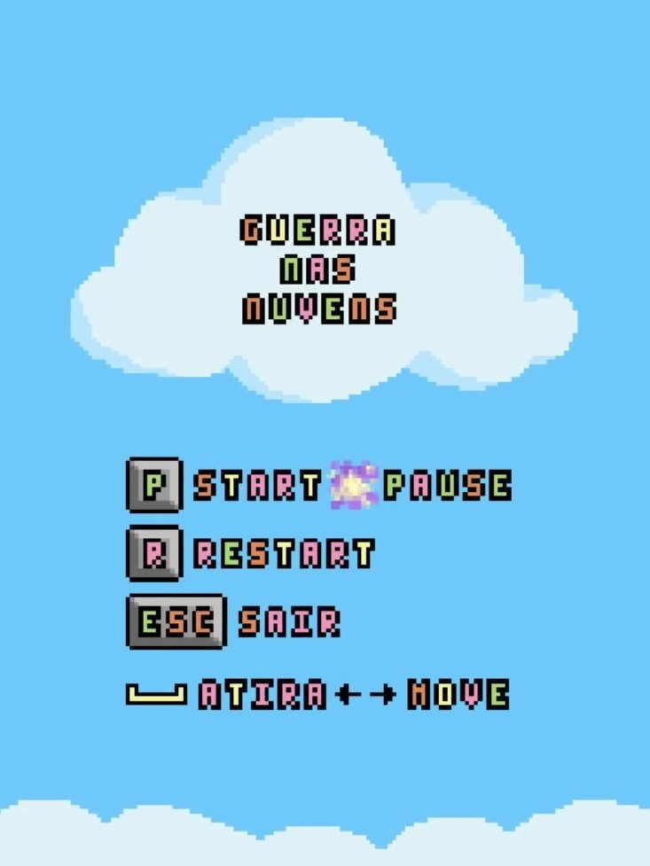
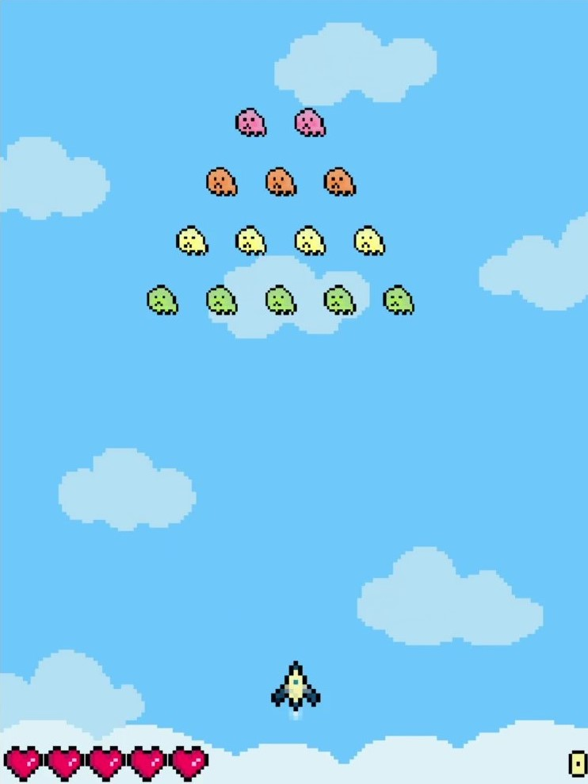
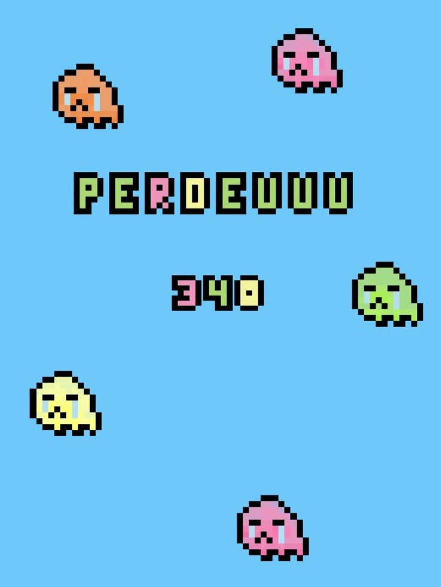

# Guerra nas Nuvens
O Guerra nas Nuvens é um projeto desenvolvido como parte da disciplina Computação Gráfica, do [Cefet-MG](https://cefetmg.br), inspirado no jogo Galaxian (1979).

## Capturas de tela
| Tela Inicial | Jogo | Fim de Jogo |
|:-------------------------------:|:----------------------:|:----------------------------:|
| |  |  |

## Preparando o Ambiente de Execução
Para compilar e executar o projeto é necessário instalar os seguintes recursos:
- GCC: `sudo apt install gcc`
- FreeGLUT: `sudo apt install freeglut3 freeglut3-dev`
- GLEW: `sudo apt install libglew-dev`
- SOIL: `sudo apt install libsoil-dev`

Após instalar os recursos, basta executar o arquivo `cg-galaxian.sh`, localizado na raiz do repositório. Para isso, é necessário permitir a execução do stript executando o comando `chmod +x cg-galaxian.sh` no terminal.

## Créditos
- Devs: [Luísa Oliveira](https://github.com/luisaoliveira), [Pedro Vaz](https://github.com/vazConnected) e [Stéphanie Fonseca](https://github.com/steponnie);
- Prof.: [Glender Brás](https://github.com/glenderbras).
